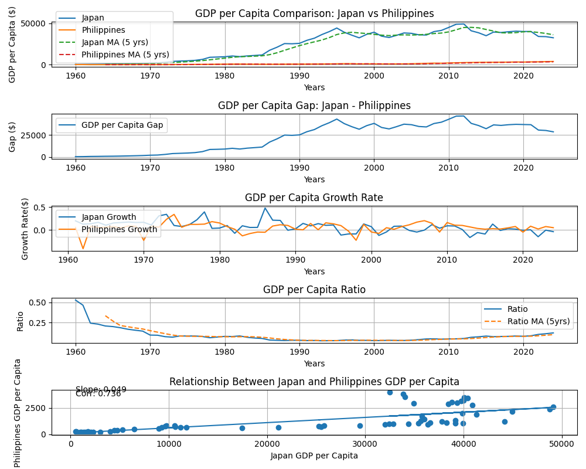

# Japan vs Philippines GDP per Capita Analysis
This project compares GDP per capita trends between Japan and the Philippines using World Bank data and Python.

## Tools Used
* Python
* pandas
* matplotlib
* numpy

## Features
* GDP per capita comparison
* Moving average analysis
* Growth rate analysis
* Ratio analysis
* Correlation analysis
* Scatter plot visualization

## Data Source
World Bank Open Data

## Key Findings
* Japan maintained a much higher GDP per capita throughout the observed period.
* The Philippines showed consistent long-term growth as an emerging economy.
* The GDP per capita gap expanded significantly during Japan's rapid economic development.
* Correlation analysis suggests a strong positive relationship between the two economies.

## Visualization

## Future Improvements
* Add ASEAN country comparisons
* Explore income convergence theories
* Perform regression analysis
* Build prediction models
